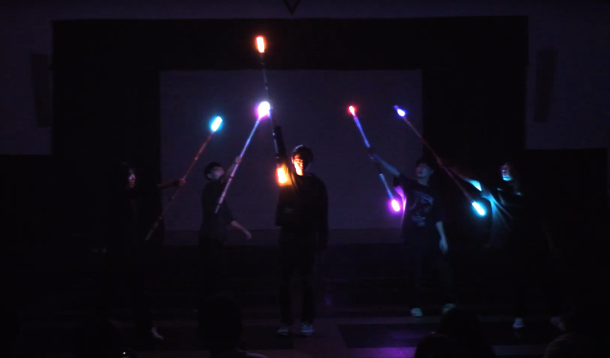

# SABERSTAFF-01

利用 attiny 85 與 433 mhz 無線收發模組製作的 ARGB 表演用光棍，解決不同裝置與電腦間的同步問題，實現了配合音樂節奏的卡點燈光表演。

The ARGB light rod made with attiny85 and 433 mhz wireless module. It solves the synchronization problem (e.g. music doesn't match the light) between different devices and computers. This made it can perform light show perfectly with music rhythm.

# Structure and how it work

```
--- PC ---

1. When Press the run button 
   |----> 2. Countdown ----> 7. Play music (Light Show will start at the same time)
   |----> 2. send reset signal via serial ----> Arduino nano + 433 mHz send module
                                                                    |
                                                                    |--> 3. send reset signal


--- SABERSTAFF ---

|---| 5. Self Reboot
|   |
|   ∨
-- attiny 85 <------- 433 mHz receive module (4. send a reset signal when receive data)
    |
    ∨
    6. Countdown
    |
    ∨
    7. Start the Light Show (Music will start at the same time)

```


# Design
## Hardware
### Schematic


### PCB Design in 2D


### PCB Design in 3D


### Real PCB 


## Software

* Folder - PcControlArduino
  * python_control_arduino.py - control arduino via serial and control music playing at the same time.
* Folder - 433mhzDataSender_nano_ver
  * 433mhzDataSender_nano_ver.ino - the sender's code
* Folder - v1.3_simple_attiny_ver
  * v1.3_simple_attiny_ver.ino - main code of the rod, include self-reboot and how to recieve data.
  * music_data.h - can set delay_time, what style you like and how long the style will persist.
  * others - light sytle library and relative codes.

# Demo
 



Full video :

https://youtu.be/G6jGiNdFs2k

# Where the dream begins...

Before I made the first verison of light rod, we use glow stick in the light show. Glow stick is heavy, expensive and not bright enough. To slove these problems, I decided to invent a thing that can do better and have many style. So here it comes.

In 2020, the first design was born. It made up of metal rod, plastic bottle and lots of items. It is bright enough, have many light style , but can't sychronize with each other. This made the light a little bit messy. Soon, because deadline is coming, this issue had been postponed.

Although the orignal design is beautiful, it is actually heavy and fragile. Often, I need to spend a lot of time to fix it. So the new design is needed. Pictures below is the orignal verion.

### The First design


### The finished product


### The Show 


### How it broke


